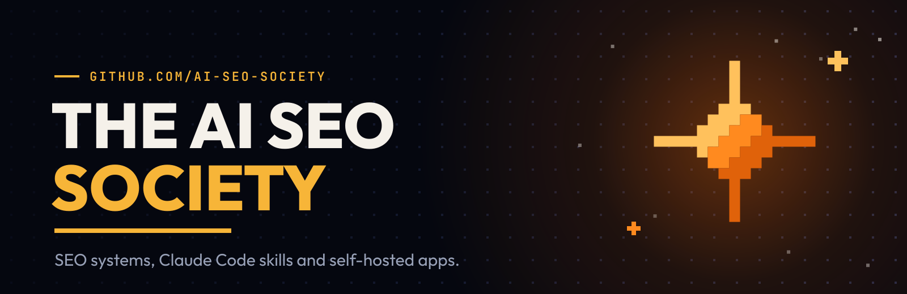
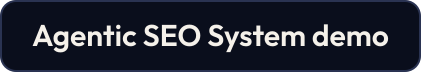
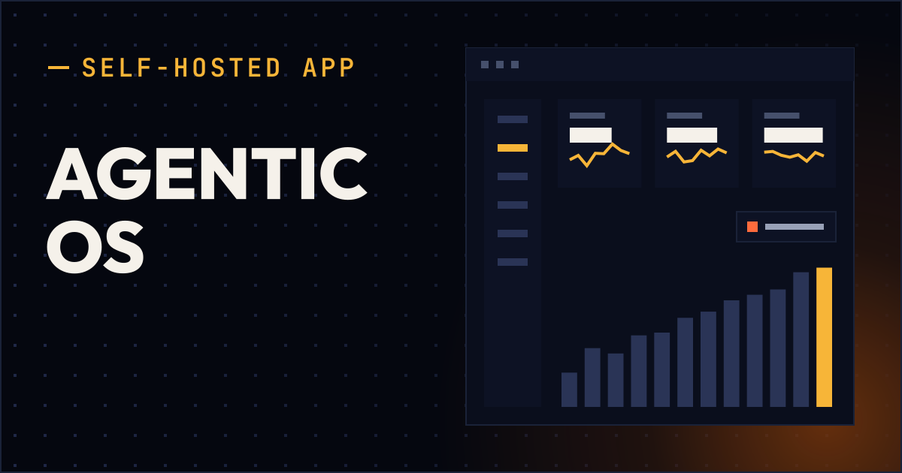
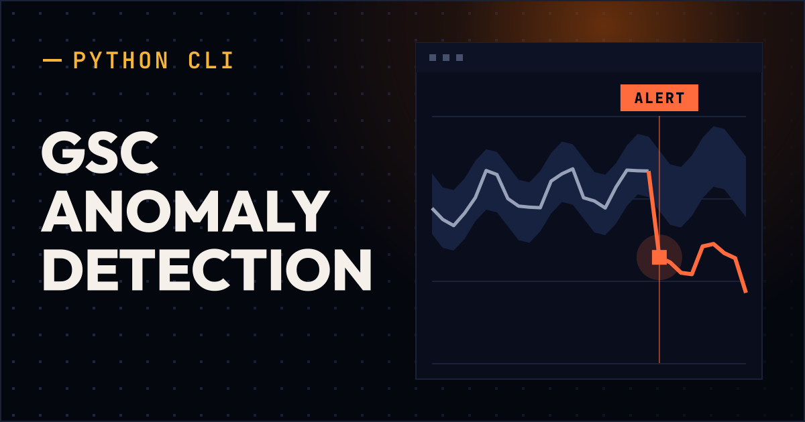

<!--
  Organization profile of https://github.com/ai-seo-society

  GENERATED FILE. Edits here are overwritten, and `check` fails on them.
    prose ............ templates/README.md.tmpl
    one repository ... catalog.yaml
    facts ............ data/org.json (written by `refresh` from GitHub)
  Rebuild: uv run python -m profilegen update
-->

<picture>
  <source media="(prefers-color-scheme: dark)" srcset="./assets/header-dark.svg">
  <source media="(prefers-color-scheme: light)" srcset="./assets/header-light.svg">
  
</picture>

  
  

## Where the code lives

This organization is the code side of [The AI SEO Society](https://www.skool.com/ai-automation-community).

I build SEO systems, Claude Code skills and self-hosted apps. Each one runs on my own sites first. Then it ships here.

## What is inside

### Self-hosted apps

They run on your machine or your own server. Your keys, your data, no service of mine in between.

<table>
<tr>
<td width="290" valign="top"></td>
<td valign="top">

**[Agentic OS](https://github.com/ai-seo-society/agentic-os-application)** 
<code>agentic-os-application</code> · **v2.1.2** · 28 Sep 2026

Tracks competitors, your social and YouTube numbers, and changes on pages you watch. Tells you when something moves. Runs in one Docker container.

</td>
</tr>
</table>

### Tools

One job each. Set them up once; they run on a schedule and tell you when to look.

<table>
<tr>
<td width="290" valign="top"></td>
<td valign="top">

**[GSC Anomaly Detection](https://github.com/ai-seo-society/gsc-anomaly-detection)** 
<code>gsc-anomaly-detection</code> · **v1.0.0** · 28 Sep 2026

Watches your Search Console clicks, impressions and positions. When something moves more than its history says it should, you get one email.

</td>
</tr>
</table>

## Latest releases

| Date | Repository | Release |
|:--|:--|:--|
| 28 Sep 2026 | Agentic OS | [v2.1.2](https://github.com/ai-seo-society/agentic-os-application/releases/tag/v2.1.2) |
| 28 Sep 2026 | GSC Anomaly Detection | [v1.0.0](https://github.com/ai-seo-society/gsc-anomaly-detection/releases/tag/v1.0.0) |

## Getting in

Feel free to join [The AI SEO Society](https://www.skool.com/ai-automation-community). I occasionally offer free trials as well. Once you have joined, you are added to this GitHub organization automatically and can clone my repositories.

Already a member and a repo still 404s? Check your email for the invite, or ask inside The AI SEO Society. GitHub invitations are valid for 7 days and expire afterwards.

## License

Everything here ships under one license, the AI SEO Society Member License. It is for active, paying members. Commercial use and client work are allowed. If your membership ends, you keep the versions you have; updates stop. What you make with it is yours. The full terms are in the `LICENSE` file of every repository.

  
  

